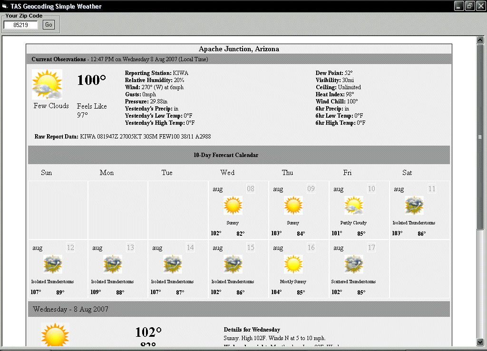



## Simple Weather With Geo Coding

### Description

I have seen a lot of people put together parsing weather information programs pulling data from pro websites that usually bomb inside of a week So I figured I would make an attempt at the same kind of project and see if I could do any better. LOL This program works by first submitting the users zip code to a geo database and returning XML then parses the data URL from the XML to finally gather and then filter the weather data the way it should be done. Like the name says it was a simple project, hope you like it.
 
### More Info
 

             |
---                |---
**Submitted On**   |2007-08-08 13:50:14
**By**             |[Thomas Swift](https://github.com/Planet-Source-Code/PSCIndex/blob/master/ByAuthor/thomas-swift.md)
**Level**          |Intermediate
**User Rating**    |5.0 (10 globes from 2 users)
**Compatibility**  |VB 6\.0
**Category**       |[Internet/ HTML](https://github.com/Planet-Source-Code/PSCIndex/blob/master/ByCategory/internet-html__1-34.md)
**World**          |[Visual Basic](https://github.com/Planet-Source-Code/PSCIndex/blob/master/ByWorld/visual-basic.md)
**Archive File**   |[Simple\_Wea207878882007\.zip](https://github.com/Planet-Source-Code/thomas-swift-simple-weather-with-geo-coding__1-69120/archive/master.zip)

